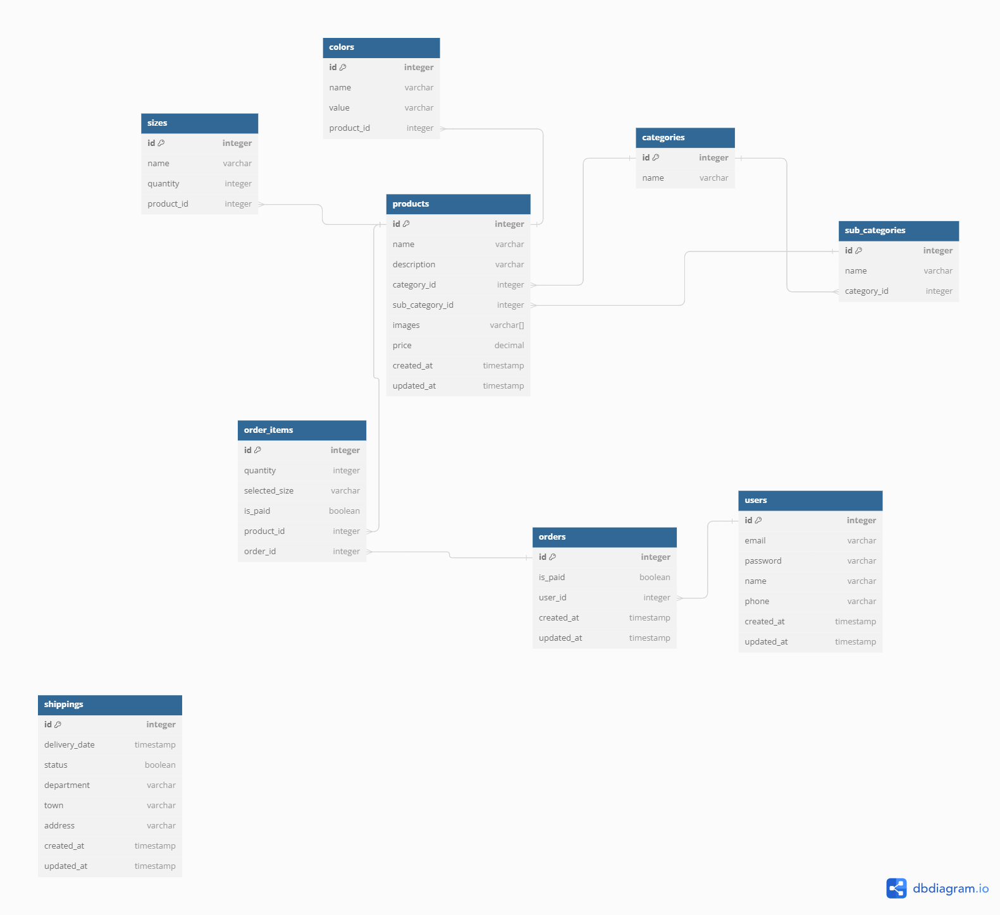

# Proyecto Tienda online Unidad de emprendimiento UPTC sogamoso


- **Vista**: El consumo de esta API se encuentra en el siguiente repositorio, un proyecto creado con React js
     ```
     https://github.com/Yesid-r/store
     ```

## Tecnologías Utilizadas

- **Nodejs 20**
- **Prisma**
- **Express**
- **Bcrypt**
- **JWT**
- **cors**
- **nodemon**
- **dotenv**

## Base de datos
